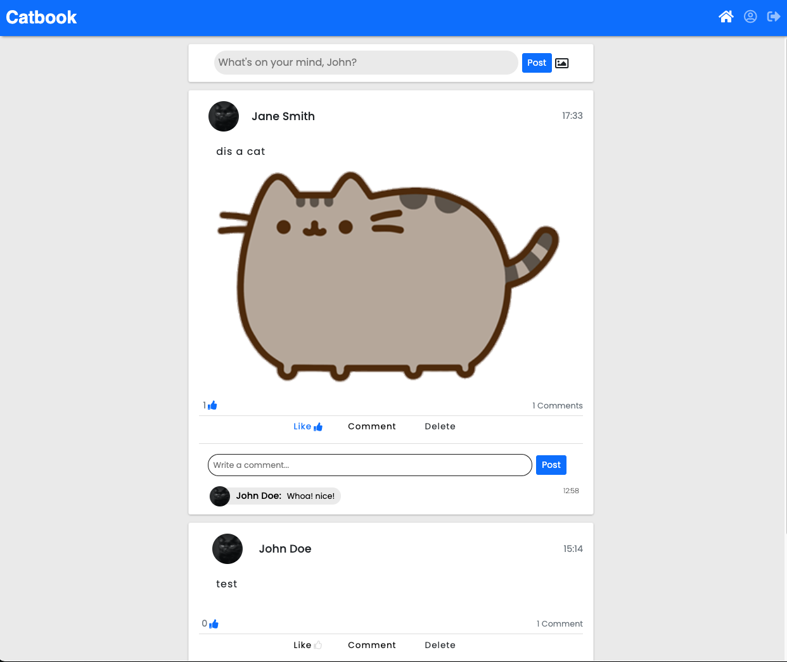

# AceBook ('CatBook')
### [Makers Academy](http://www.makersacademy.com) - Week 8 Group Project

Thhe objective of this group project was to build a Facebook clone. 

## Screenshots




## Task

### Requirements 

- Users can sign up
- Users can log in
- Users can log out
- Posts appear with the newest post first
- Users can comment on posts
- Users can like posts and the number of likes is visible next to the post
- A user's name and a little photo of them appears next to their posts
- Users can navigate the website with a nav bar at the top of the page
- Users can upload photos and see them just like posts

## <a name="Technologies">Technologies</a>
* Ruby
* Rails
* Rspec
* Javascript
* Ajax
* JQuery
* HTML
* CSS

## Planning 

#### Wireframe
[See Mockup here](https://wireframe.cc/pro/pp/053781eeb458770)

#### Sequence diagram


#### Database structure


## How to use

#### Clone the repo
```shell
$ git clone https://github.com/ArifEbrahim/catbook.git
$ cd catbook
```

### Install the project
``` shell
$ bundle install
$ bin/rails db:create
$ bin/rails db:migrate
$ bin/rails server 
```
Navigate to localhost:3000 in your web browser

#### Testing
All testing was done in RSpec. To run the tests, enter the following command in the terminal:
```shell
$ rspec
```

## <a name="Heroku">Live on Heroku</a>
[Use on Heroku](https://gentle-wave-85477.herokuapp.com/)